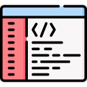

# advpl-functions-list

A extensão *Function List* é uma ferramenta poderosa projetada para desenvolvedores que trabalham com Visual Studio Code. Esta extensão oferece uma maneira conveniente de listar e explorar funções presentes no arquivo em edição diretamente na barra lateral do explorador de arquivos.

Com a *Function List*, os desenvolvedores podem organizar e visualizar facilmente as funções presentes no código-fonte, separadas em duas categorias principais: Funções Estáticas e Funções do Usuário.

## Recursos Principais

- **Navegação Simplificada:** Navegue rapidamente pelas funções do arquivo atualmente em edição diretamente na barra lateral do explorador de arquivos.
  
- **Organização por Categoria:** As funções estão organizadas em duas categorias distintas: *Static Functions* e *User Functions*, facilitando a localização e a compreensão do código.
  
- **Atualização Automática:** A lista de funções é atualizada automaticamente conforme você edita o arquivo, garantindo que você sempre tenha acesso às últimas alterações.

## Como Usar

Basta abrir um arquivo de código-fonte no Visual Studio Code e visualizar a barra lateral do explorador de arquivos. Você encontrará dois menus: *Static Functions* e *User Functions*, cada um contendo as respectivas funções encontradas no arquivo em edição.

## Amostra

## Requisitos

Não há requisitos ou dependências específicas para esta extensão. Ela se integra perfeitamente ao seu ambiente do Visual Studio Code.

## Configurações da Extensão

advplParametersList.regex.GetMV: Define expressao regex para busca das chamadas a funcao GetMV
advplParametersList.regex.GetNewPar: Define expressao regex para busca das chamadas a funcao GetNewPar
advplParametersList.regex.SuperGetMV: Define expressao regex para busca das chamadas a funcao SuperGetMV

## Contribua

Você pode contribuir com o desenvolvimento desta extensão de várias maneiras:

1. Reporte problemas e sugira novos recursos na [página de issues do GitHub](https://github.com/juliansantosinfo/advpl-functions-list/issues).
2. Faça um fork do repositório, faça suas alterações e envie um pull request.
3. Ajude a melhorar a documentação.
4. Compartilhe esta extensão com outros desenvolvedores.

## Problemas Conhecidos

Atualmente não há problemas conhecidos com esta extensão. Se encontrar algum problema, por favor, reporte na [página de issues do GitHub](https://github.com/juliansantosinfo/advpl-functions-list/issues).

## Notas de Lançamento

- **1.0.0:** Lançamento inicial da extensão **advpl-parameters-list**. Adiciona suporte para listar e explorar funções estáticas e funções do usuário diretamente na barra lateral do explorador de arquivos.

